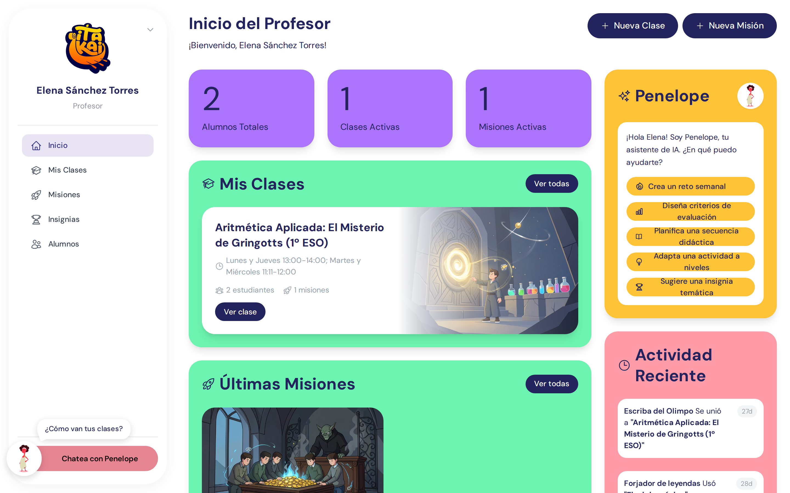
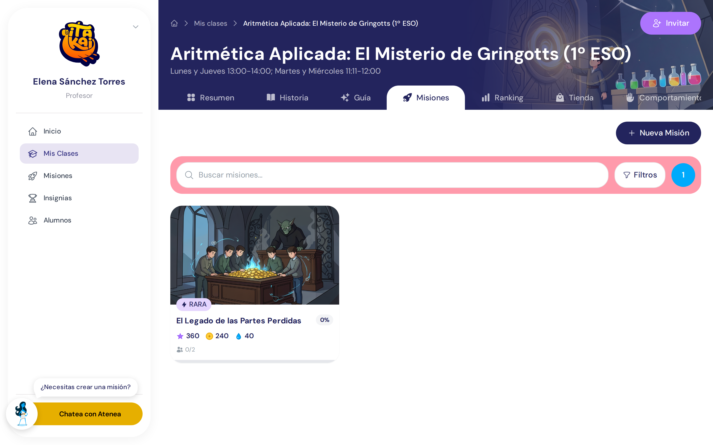
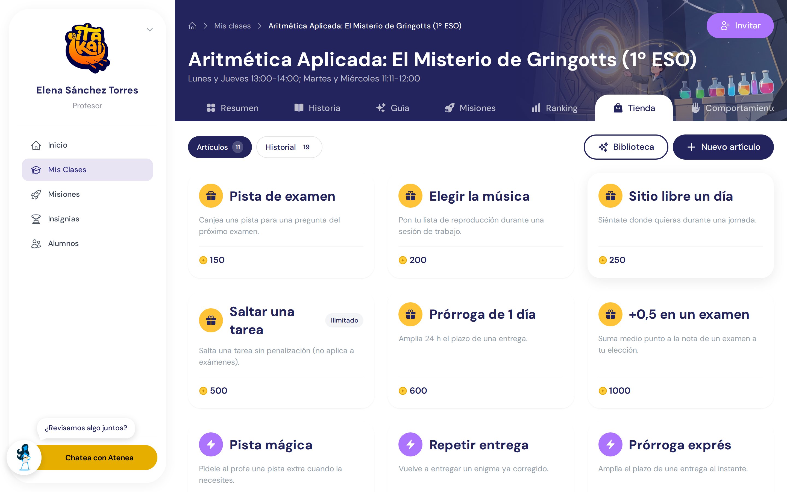
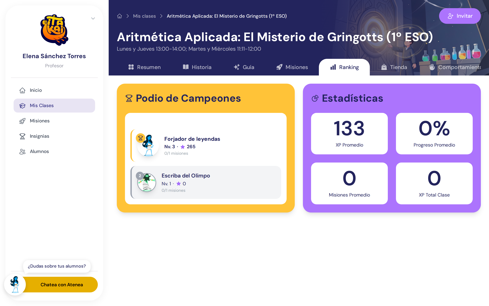

<div align="center">
  <a href="https://itakai.es">
    
  </a>

  <h1>🏛️ ITAKAI</h1>
  <p><strong>Plataforma Educativa Gamificada de Código Abierto</strong></p>
  <p>Transforma el aprendizaje en una aventura épica inspirada en la mitología griega</p>

  <p>
    <a href="https://itakai.es"><strong>Website</strong></a> ·
    <a href="https://feedback.itakai.es"><strong>Reportar Bug</strong></a> ·
    <a href="https://x.com/proyectoitakai"><strong>Comunidad</strong></a>
  </p>

  <p>
    <a href="https://github.com/itakai-es/platform-new/stargazers">
      
    </a>
    <a href="https://github.com/itakai-es/platform-new/network/members">
      
    </a>
    <a href="https://github.com/itakai-es/platform-new/blob/main/LICENSE">
      
    </a>
  </p>
</div>

---

## 📸 Vista Previa

<div align="center">
  
  
  
  
</div>

---

## ✨ Características Principales

<table>
  <tr>
    <td width="50%">

### 🎮 Gamificación Completa
- **Sistema de XP y niveles** con progresión equilibrada
- **Títulos mitológicos** desde Mortal hasta Dios del Olimpo
- **Logros y medallas** desbloqueables
- **Clasificaciones** en tiempo real
- **Racha de aprendizaje** para motivación diaria

    </td>
    <td width="50%">

### 🎯 Misiones Educativas
- **Misiones temáticas** organizadas por rareza
- **Enigmas interactivos** con recompensas XP
- **Progreso visual** con barras y estadísticas
- **Feedback inmediato** para estudiantes
- **Sistema de hints** progresivo

    </td>
  </tr>
  <tr>
    <td width="50%">

### 👥 Gestión de Roles
- **Estudiantes** - Completan misiones y ganan XP
- **Profesores** - Crean contenido y gestionan clases
- **Admins** - Configuración y analytics del sistema
- **Permisos granulares** por rol
- **Onboarding guiado** para cada perfil

    </td>
    <td width="50%">

### 📊 Analytics Avanzados
- **Dashboard de progreso** personalizado
- **Estadísticas detalladas** por estudiante/clase
- **Gráficos interactivos** de rendimiento
- **Exportación de datos** CSV/PDF
- **Métricas en tiempo real**

    </td>
  </tr>
  <tr>
    <td width="50%">

### 🎨 Diseño Inmersivo
- **Tema mitología griega** consistente
- **Interfaz moderna** con Tailwind CSS
- **Animaciones fluidas** y micro-interacciones
- **Responsive design** para todos los dispositivos
- **Dark mode** nativo

    </td>
    <td width="50%">

### 🔐 Seguridad Robusta
- **Autenticación JWT** con refresh tokens
- **OAuth 2.0** (Google, GitHub)
- **Encriptación** de datos sensibles
- **Rate limiting** y protección DDoS
- **RBAC** (Role-Based Access Control)

    </td>
  </tr>
</table>

---

## 🚀 Instalación Rápida

### Opción 1: Docker (Recomendado)

```bash
# Clonar el repositorio
git clone https://github.com/itakai-es/platform-new.git
cd platform-new

# Configurar variables de entorno
cp .env.example .env

# Levantar con Docker Compose
docker-compose up -d

# Acceder en http://localhost:4000
```

### Opción 2: Instalación Manual

```bash
# Requisitos: Node.js 18+, pnpm

# Instalar dependencias
pnpm install

# Configurar entorno
cp .env.example .env

# Modo desarrollo
pnpm dev

# Build para producción
pnpm build
pnpm preview
```

### Opción 3: Deploy en la Nube

[](https://vercel.com/new/clone?repository-url=https://github.com/itakai-es/platform-new)
[](https://app.netlify.com/start/deploy?repository=https://github.com/itakai-es/platform-new)

---

## 🎯 ¿Por Qué ITAKAI?

<table>
  <tr>
    <th>Característica</th>
    <th>ITAKAI</th>
    <th>Moodle</th>
    <th>Google Classroom</th>
    <th>Kahoot</th>
  </tr>
  <tr>
    <td><strong>Gamificación completa</strong></td>
    <td>✅</td>
    <td>🟡 Plugins</td>
    <td>❌</td>
    <td>🟡 Limitada</td>
  </tr>
  <tr>
    <td><strong>100% Open Source</strong></td>
    <td>✅</td>
    <td>✅</td>
    <td>❌</td>
    <td>❌</td>
  </tr>
  <tr>
    <td><strong>Self-hosted</strong></td>
    <td>✅</td>
    <td>✅</td>
    <td>❌</td>
    <td>❌</td>
  </tr>
  <tr>
    <td><strong>Interfaz moderna</strong></td>
    <td>✅</td>
    <td>❌</td>
    <td>🟡</td>
    <td>✅</td>
  </tr>
  <tr>
    <td><strong>Sistema de niveles</strong></td>
    <td>✅</td>
    <td>❌</td>
    <td>❌</td>
    <td>❌</td>
  </tr>
  <tr>
    <td><strong>Clasificaciones</strong></td>
    <td>✅</td>
    <td>🟡 Plugins</td>
    <td>❌</td>
    <td>✅</td>
  </tr>
  <tr>
    <td><strong>Sin límites de usuarios</strong></td>
    <td>✅</td>
    <td>✅</td>
    <td>🟡 Límites</td>
    <td>🟡 Planes</td>
  </tr>
  <tr>
    <td><strong>API REST completa</strong></td>
    <td>✅</td>
    <td>✅</td>
    <td>🟡 Limitada</td>
    <td>❌</td>
  </tr>
</table>

---

## 🛠️ Stack Tecnológico

<div align="center">

### Frontend
[](https://nuxt.com/)
[](https://www.typescriptlang.org/)
[](https://tailwindcss.com/)
[](https://pinia.vuejs.org/)

### Backend (Opcional - para features avanzadas)
[](https://www.fastify.io/)
[](https://www.prisma.io/)
[](https://www.postgresql.org/)

### Testing & Quality
[](https://playwright.dev/)
[](https://eslint.org/)
[](https://prettier.io/)

### DevOps
[](https://www.docker.com/)
[](https://github.com/features/actions)

</div>

---

## 📚 Documentación

| Sección | Descripción |
|---------|-------------|
| 🤝 [Guía de Contribución](./CONTRIBUTING.md) | Cómo contribuir al proyecto |
| 🔒 [Seguridad](./SECURITY.md) | Política de seguridad y reporte de vulnerabilidades |
| 📋 [Código de Conducta](./CODE_OF_CONDUCT.md) | Reglas de convivencia en el proyecto |

---

## 🗺️ Roadmap

### ✅ Versión 1.0 (Actual)
- [x] Sistema de autenticación completo
- [x] Gamificación (XP, niveles, títulos)
- [x] Misiones y enigmas
- [x] Clasificaciones y estadísticas
- [x] Dashboard para estudiantes y profesores
- [x] Sistema de logros
- [x] Responsive design

### 🚧 Versión 1.1 (En Desarrollo)
- [ ] Sistema de notificaciones en tiempo real
- [ ] Chat entre estudiantes y profesores
- [ ] Asistente IA para ayuda educativa
- [ ] Modo colaborativo para misiones
- [ ] Exportación avanzada de reportes

### 🔮 Versión 2.0 (Planificado)
- [ ] App móvil nativa (iOS/Android)
- [ ] Integración con LMS externos (Moodle, Canvas)
- [ ] Marketplace de misiones comunitarias
- [ ] Sistema de creación de contenido visual
- [ ] Multi-tenancy para instituciones
- [ ] Analytics con IA predictiva


---

## 🤝 Contribuir

¡Las contribuciones son bienvenidas! ITAKAI es un proyecto impulsado por la comunidad.

### Formas de Contribuir

- 🐛 **Reportar bugs** - En [feedback.itakai.es](https://feedback.itakai.es)
- 💡 **Sugerir features** - En [feedback.itakai.es](https://feedback.itakai.es)
- 📝 **Mejorar documentación** - Hacer un PR con mejoras
- 🌍 **Traducir** - Ayudar con i18n a otros idiomas
- 💻 **Código** - Revisar [issues abiertos](https://github.com/itakai-es/platform-new/issues)

### Guía Rápida

```bash
# 1. Fork el proyecto
# 2. Crear rama para tu feature
git checkout -b feature/amazing-feature

# 3. Hacer cambios y commit
git commit -m 'feat: add amazing feature'

# 4. Push a tu fork
git push origin feature/amazing-feature

# 5. Abrir Pull Request
```

Lee nuestra [Guía de Contribución](./CONTRIBUTING.md) para más detalles.

---

## 👥 Comunidad

<div align="center">

[](https://x.com/proyectoitakai)

</div>

Novedades, avances y comunidad en [x.com/proyectoitakai](https://x.com/proyectoitakai).

---

## 🌟 Casos de Uso

### 🏫 Centros Educativos
> "ITAKAI aumentó la participación de nuestros estudiantes en un 85%. La gamificación hace que el aprendizaje sea divertido y medible."
>
> — **IES Innovación**, Madrid

### 👨‍🏫 Profesores Independientes
> "Crear misiones temáticas es súper intuitivo. Mis alumnos están más motivados que nunca."
>
> — **Laura Martínez**, Profesora de Matemáticas

### 🏢 Formación Corporativa
> "Usamos ITAKAI para onboarding de empleados. El sistema de niveles hace el proceso más atractivo."
>
> — **TechCorp**, Barcelona

---

## 📊 Estadísticas del Proyecto

<div align="center">


</div>

---

## 📄 Licencia

ITAKAI está licenciado bajo la [Licencia GPL-3.0](./LICENSE).

Esto significa que puedes:
- ✅ Usar comercialmente
- ✅ Modificar el código
- ✅ Distribuir
- ✅ Uso privado

Con la condición de:
- 📋 Incluir el aviso de licencia y copyright

---

## 🙏 Agradecimientos

Agradecemos a todos los contribuidores que han hecho posible este proyecto:

<a href="https://github.com/itakai-es/platform-new/graphs/contributors">
  
</a>

### Tecnologías que usamos

- [Nuxt](https://nuxt.com/) - El increíble framework de Vue.js
- [Tailwind CSS](https://tailwindcss.com/) - Framework CSS utility-first
- [Playwright](https://playwright.dev/) - Testing E2E confiable
- [Prisma](https://www.prisma.io/) - ORM moderno para TypeScript
- [Fastify](https://www.fastify.io/) - Framework web ultrarrápido

---

## 🔗 Enlaces Útiles

- 🌐 [Website Oficial](https://itakai.es)
- 🐛 [Reportar bugs y sugerencias](https://feedback.itakai.es)
- 🐦 [X / Twitter](https://x.com/proyectoitakai)
- 📦 [Releases](https://github.com/itakai-es/platform-new/releases)

---

<div align="center">

### ⭐ Si te gusta ITAKAI, dale una estrella en GitHub

[](https://star-history.com/#itakai-es/platform-new&Date)

---

**Construido con ❤️ por el equipo de ITAKAI**

[Website](https://itakai.es) • [Reportar bug](https://feedback.itakai.es) • [X](https://x.com/proyectoitakai)

</div>
